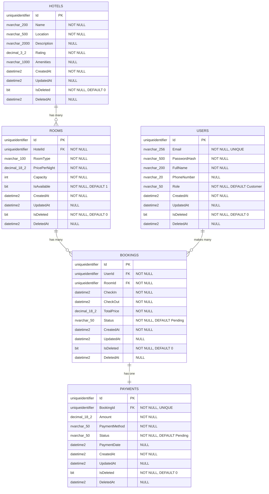

# Database Schema Documentation

## Overview

This document provides comprehensive documentation for the Hotel Booking System database schema. The system uses SQL Server with Entity Framework Core and implements a soft delete strategy across all entities.

## Entity Relationship Diagram



## Table Definitions

### 1. Hotels Table

Stores information about hotels in the system.

**Primary Key:**
- `Id` (uniqueidentifier) - Auto-generated GUID

**Columns:**

| Column | Data Type | Nullable | Default | Max Length | Description |
|--------|-----------|----------|---------|------------|-------------|
| Id | uniqueidentifier | NO | NEWID() | - | Primary key |
| Name | nvarchar | NO | - | 200 | Hotel name |
| Location | nvarchar | NO | - | 500 | Hotel address/location |
| Description | nvarchar | YES | NULL | 2000 | Detailed hotel description |
| Rating | decimal(3,2) | NO | 0.00 | - | Hotel rating (0.00-5.00) |
| Amenities | nvarchar | YES | NULL | 1000 | Comma-separated amenities list |
| CreatedAt | datetime2 | NO | GETUTCDATE() | - | Record creation timestamp |
| UpdatedAt | datetime2 | YES | NULL | - | Last update timestamp |
| IsDeleted | bit | NO | 0 | - | Soft delete flag |
| DeletedAt | datetime2 | YES | NULL | - | Soft delete timestamp |

**Indexes:**
- `PK_Hotels` (Clustered) on `Id`
- `IX_Hotels_Location` (Nonclustered) on `Location`
- `IX_Hotels_Rating` (Nonclustered) on `Rating`

**Foreign Keys:** None

---

### 2. Rooms Table

Stores room information for each hotel.

**Primary Key:**
- `Id` (uniqueidentifier) - Auto-generated GUID

**Foreign Keys:**
- `HotelId` → `Hotels.Id` (ON DELETE RESTRICT)

**Columns:**

| Column | Data Type | Nullable | Default | Max Length | Description |
|--------|-----------|----------|---------|------------|-------------|
| Id | uniqueidentifier | NO | NEWID() | - | Primary key |
| HotelId | uniqueidentifier | NO | - | - | Foreign key to Hotels |
| RoomType | nvarchar | NO | - | 100 | Room type (Single, Double, Suite, etc.) |
| PricePerNight | decimal(18,2) | NO | - | - | Nightly rate |
| Capacity | int | NO | - | - | Maximum guest capacity |
| IsAvailable | bit | NO | 1 | - | Availability status |
| CreatedAt | datetime2 | NO | GETUTCDATE() | - | Record creation timestamp |
| UpdatedAt | datetime2 | YES | NULL | - | Last update timestamp |
| IsDeleted | bit | NO | 0 | - | Soft delete flag |
| DeletedAt | datetime2 | YES | NULL | - | Soft delete timestamp |

**Indexes:**
- `PK_Rooms` (Clustered) on `Id`
- `IX_Rooms_HotelId` (Nonclustered) on `HotelId`
- `IX_Rooms_IsAvailable` (Nonclustered) on `IsAvailable`
- `IX_Rooms_RoomType` (Nonclustered) on `RoomType`

**Relationships:**
- Many-to-One with Hotels (RESTRICT delete to prevent orphaned rooms)

---

### 3. Users Table

Stores user account information.

**Primary Key:**
- `Id` (uniqueidentifier) - Auto-generated GUID

**Columns:**

| Column | Data Type | Nullable | Default | Max Length | Description |
|--------|-----------|----------|---------|------------|-------------|
| Id | uniqueidentifier | NO | NEWID() | - | Primary key |
| Email | nvarchar | NO | - | 256 | User email (unique) |
| PasswordHash | nvarchar | NO | - | 500 | Hashed password |
| FullName | nvarchar | NO | - | 200 | User's full name |
| PhoneNumber | nvarchar | YES | NULL | 20 | Contact phone number |
| Role | nvarchar | NO | 'Customer' | 50 | User role (Admin, Customer) |
| CreatedAt | datetime2 | NO | GETUTCDATE() | - | Record creation timestamp |
| UpdatedAt | datetime2 | YES | NULL | - | Last update timestamp |
| IsDeleted | bit | NO | 0 | - | Soft delete flag |
| DeletedAt | datetime2 | YES | NULL | - | Soft delete timestamp |

**Indexes:**
- `PK_Users` (Clustered) on `Id`
- `IX_Users_Email` (Unique, Nonclustered) on `Email`
- `IX_Users_Role` (Nonclustered) on `Role`

**Constraints:**
- UNIQUE constraint on `Email` column

**Foreign Keys:** None

---

### 4. Bookings Table

Stores booking information linking users and rooms.

**Primary Key:**
- `Id` (uniqueidentifier) - Auto-generated GUID

**Foreign Keys:**
- `UserId` → `Users.Id` (ON DELETE RESTRICT)
- `RoomId` → `Rooms.Id` (ON DELETE RESTRICT)

**Columns:**

| Column | Data Type | Nullable | Default | Max Length | Description |
|--------|-----------|----------|---------|------------|-------------|
| Id | uniqueidentifier | NO | NEWID() | - | Primary key |
| UserId | uniqueidentifier | NO | - | - | Foreign key to Users |
| RoomId | uniqueidentifier | NO | - | - | Foreign key to Rooms |
| CheckIn | datetime2 | NO | - | - | Check-in date and time |
| CheckOut | datetime2 | NO | - | - | Check-out date and time |
| TotalPrice | decimal(18,2) | NO | - | - | Total booking cost |
| Status | nvarchar | NO | 'Pending' | 50 | Booking status (Pending, Confirmed, Cancelled, Completed) |
| CreatedAt | datetime2 | NO | GETUTCDATE() | - | Record creation timestamp |
| UpdatedAt | datetime2 | YES | NULL | - | Last update timestamp |
| IsDeleted | bit | NO | 0 | - | Soft delete flag |
| DeletedAt | datetime2 | YES | NULL | - | Soft delete timestamp |

**Indexes:**
- `PK_Bookings` (Clustered) on `Id`
- `IX_Bookings_UserId` (Nonclustered) on `UserId`
- `IX_Bookings_RoomId` (Nonclustered) on `RoomId`
- `IX_Bookings_CheckIn` (Nonclustered) on `CheckIn`
- `IX_Bookings_CheckOut` (Nonclustered) on `CheckOut`
- `IX_Bookings_Status` (Nonclustered) on `Status`
- `IX_Bookings_RoomId_CheckIn_CheckOut` (Composite, Nonclustered) on `RoomId, CheckIn, CheckOut`

**Relationships:**
- Many-to-One with Users (RESTRICT delete to preserve booking history)
- Many-to-One with Rooms (RESTRICT delete to preserve booking history)
- One-to-One with Payments

---

### 5. Payments Table

Stores payment information for bookings.

**Primary Key:**
- `Id` (uniqueidentifier) - Auto-generated GUID

**Foreign Keys:**
- `BookingId` → `Bookings.Id` (ON DELETE RESTRICT, UNIQUE)

**Columns:**

| Column | Data Type | Nullable | Default | Max Length | Description |
|--------|-----------|----------|---------|------------|-------------|
| Id | uniqueidentifier | NO | NEWID() | - | Primary key |
| BookingId | uniqueidentifier | NO | - | - | Foreign key to Bookings (unique) |
| Amount | decimal(18,2) | NO | - | - | Payment amount |
| PaymentMethod | nvarchar | NO | - | 50 | Payment method (CreditCard, DebitCard, PayPal, Cash) |
| Status | nvarchar | NO | 'Pending' | 50 | Payment status (Pending, Completed, Failed, Refunded) |
| PaymentDate | datetime2 | YES | NULL | - | Actual payment date and time |
| CreatedAt | datetime2 | NO | GETUTCDATE() | - | Record creation timestamp |
| UpdatedAt | datetime2 | YES | NULL | - | Last update timestamp |
| IsDeleted | bit | NO | 0 | - | Soft delete flag |
| DeletedAt | datetime2 | YES | NULL | - | Soft delete timestamp |

**Indexes:**
- `PK_Payments` (Clustered) on `Id`
- `IX_Payments_BookingId` (Unique, Nonclustered) on `BookingId`
- `IX_Payments_Status` (Nonclustered) on `Status`
- `IX_Payments_PaymentDate` (Nonclustered) on `PaymentDate`

**Relationships:**
- One-to-One with Bookings (RESTRICT delete to preserve payment records)

---

## Database Indexes

### Performance Indexes

| Table | Index Name | Type | Columns | Purpose |
|-------|-----------|------|---------|---------|
| Hotels | IX_Hotels_Location | Nonclustered | Location | Search hotels by location |
| Hotels | IX_Hotels_Rating | Nonclustered | Rating | Filter hotels by rating |
| Rooms | IX_Rooms_HotelId | Nonclustered | HotelId | Query rooms by hotel |
| Rooms | IX_Rooms_IsAvailable | Nonclustered | IsAvailable | Find available rooms |
| Rooms | IX_Rooms_RoomType | Nonclustered | RoomType | Filter by room type |
| Users | IX_Users_Email | Unique, Nonclustered | Email | User authentication and lookup |
| Users | IX_Users_Role | Nonclustered | Role | Filter users by role |
| Bookings | IX_Bookings_UserId | Nonclustered | UserId | Query user bookings |
| Bookings | IX_Bookings_RoomId | Nonclustered | RoomId | Query room bookings |
| Bookings | IX_Bookings_CheckIn | Nonclustered | CheckIn | Date range queries |
| Bookings | IX_Bookings_CheckOut | Nonclustered | CheckOut | Date range queries |
| Bookings | IX_Bookings_Status | Nonclustered | Status | Filter by booking status |
| Bookings | IX_Bookings_RoomId_CheckIn_CheckOut | Composite, Nonclustered | RoomId, CheckIn, CheckOut | Room availability checks |
| Payments | IX_Payments_BookingId | Unique, Nonclustered | BookingId | One-to-one relationship enforcement |
| Payments | IX_Payments_Status | Nonclustered | Status | Filter by payment status |
| Payments | IX_Payments_PaymentDate | Nonclustered | PaymentDate | Payment history queries |

### Index Strategy

- **Primary Keys**: All tables use clustered indexes on the `Id` column (GUID)
- **Foreign Keys**: Nonclustered indexes automatically created for all foreign key columns
- **Unique Constraints**: Enforced via unique nonclustered indexes (Users.Email, Payments.BookingId)
- **Composite Indexes**: Used for complex queries (e.g., room availability checks)

---

## Relationships and Cardinality

### 1. Hotel → Rooms (One-to-Many)

- **Relationship**: One hotel can have multiple rooms
- **Foreign Key**: `Rooms.HotelId` → `Hotels.Id`
- **Delete Behavior**: RESTRICT
- **Rationale**: Prevents accidental deletion of hotels with existing rooms

```sql
ALTER TABLE Rooms
ADD CONSTRAINT FK_Rooms_Hotels_HotelId
FOREIGN KEY (HotelId) REFERENCES Hotels(Id)
ON DELETE NO ACTION;
```

### 2. User → Bookings (One-to-Many)

- **Relationship**: One user can make multiple bookings
- **Foreign Key**: `Bookings.UserId` → `Users.Id`
- **Delete Behavior**: RESTRICT
- **Rationale**: Preserves booking history even if user account is deleted (soft delete)

```sql
ALTER TABLE Bookings
ADD CONSTRAINT FK_Bookings_Users_UserId
FOREIGN KEY (UserId) REFERENCES Users(Id)
ON DELETE NO ACTION;
```

### 3. Room → Bookings (One-to-Many)

- **Relationship**: One room can have multiple bookings
- **Foreign Key**: `Bookings.RoomId` → `Rooms.Id`
- **Delete Behavior**: RESTRICT
- **Rationale**: Preserves booking history for rooms

```sql
ALTER TABLE Bookings
ADD CONSTRAINT FK_Bookings_Rooms_RoomId
FOREIGN KEY (RoomId) REFERENCES Rooms(Id)
ON DELETE NO ACTION;
```

### 4. Booking → Payment (One-to-One)

- **Relationship**: Each booking has exactly one payment
- **Foreign Key**: `Payments.BookingId` → `Bookings.Id` (UNIQUE)
- **Delete Behavior**: RESTRICT
- **Rationale**: Maintains payment audit trail

```sql
ALTER TABLE Payments
ADD CONSTRAINT FK_Payments_Bookings_BookingId
FOREIGN KEY (BookingId) REFERENCES Bookings(Id)
ON DELETE NO ACTION;

CREATE UNIQUE INDEX IX_Payments_BookingId
ON Payments(BookingId);
```

---

## Soft Delete Strategy

### Implementation

All entities inherit from `BaseEntity` which includes soft delete functionality:

```csharp
public abstract class BaseEntity
{
    public Guid Id { get; set; }
    public DateTime CreatedAt { get; set; }
    public DateTime? UpdatedAt { get; set; }
    public bool IsDeleted { get; set; }        // Soft delete flag
    public DateTime? DeletedAt { get; set; }   // Soft delete timestamp
}
```

### Columns

| Column | Type | Default | Description |
|--------|------|---------|-------------|
| IsDeleted | bit | 0 (false) | Indicates if record is deleted |
| DeletedAt | datetime2 | NULL | Timestamp when record was deleted |

### Query Filters

Entity Framework Core automatically applies query filters to exclude soft-deleted records:

```csharp
modelBuilder.Entity<TEntity>()
    .HasQueryFilter(e => !e.IsDeleted);
```

### Behavior

1. **Delete Operation**: Instead of physical deletion, sets `IsDeleted = true` and `DeletedAt = GETUTCDATE()`
2. **Query Operations**: Automatically filters out records where `IsDeleted = true`
3. **Include Deleted**: Use `.IgnoreQueryFilters()` to include soft-deleted records
4. **Restore**: Set `IsDeleted = false` and `DeletedAt = NULL`

### Benefits

- **Data Preservation**: Maintains historical data and audit trails
- **Referential Integrity**: Prevents foreign key constraint violations
- **Compliance**: Supports data retention policies and regulations
- **Recovery**: Allows restoration of accidentally deleted records
- **Analytics**: Enables analysis of deleted data

### Example Queries

```csharp
// Normal query (excludes soft-deleted)
var activeHotels = await context.Hotels.ToListAsync();

// Include soft-deleted records
var allHotels = await context.Hotels
    .IgnoreQueryFilters()
    .ToListAsync();

// Query only deleted records
var deletedHotels = await context.Hotels
    .IgnoreQueryFilters()
    .Where(h => h.IsDeleted)
    .ToListAsync();
```

---

## Audit Fields

All tables include automatic audit tracking:

| Field | Type | Description | Managed By |
|-------|------|-------------|------------|
| CreatedAt | datetime2 | Record creation timestamp | EF Core (on INSERT) |
| UpdatedAt | datetime2 | Last modification timestamp | EF Core (on UPDATE) |
| IsDeleted | bit | Soft delete flag | EF Core (on DELETE) |
| DeletedAt | datetime2 | Soft delete timestamp | EF Core (on DELETE) |

### Automatic Timestamp Management

The `ApplicationDbContext.SaveChangesAsync` method automatically manages these fields:

```csharp
public override Task<int> SaveChangesAsync(CancellationToken cancellationToken = default)
{
    var entries = ChangeTracker.Entries<BaseEntity>();

    foreach (var entry in entries)
    {
        switch (entry.State)
        {
            case EntityState.Added:
                entry.Entity.CreatedAt = DateTime.UtcNow;
                break;

            case EntityState.Modified:
                entry.Entity.UpdatedAt = DateTime.UtcNow;
                break;

            case EntityState.Deleted:
                entry.State = EntityState.Modified;
                entry.Entity.IsDeleted = true;
                entry.Entity.DeletedAt = DateTime.UtcNow;
                break;
        }
    }

    return base.SaveChangesAsync(cancellationToken);
}
```

---

## Data Types and Precision

### Numeric Types

- **GUID**: `uniqueidentifier` - Used for all primary keys
- **Decimal**: `decimal(18,2)` - Used for currency (prices, amounts)
- **Rating**: `decimal(3,2)` - Hotel ratings (0.00 to 5.00)
- **Integer**: `int` - Used for capacity and counts

### String Types

- **Short Text**: `nvarchar(50-256)` - Emails, roles, status values
- **Medium Text**: `nvarchar(200-500)` - Names, locations
- **Long Text**: `nvarchar(1000-2000)` - Descriptions, amenities

### Date/Time Types

- **datetime2**: Used for all timestamp fields (higher precision than datetime)
- **UTC Storage**: All timestamps stored in UTC

### Boolean Types

- **bit**: Used for flags (IsDeleted, IsAvailable)

---

## Naming Conventions

- **Tables**: PascalCase, plural (Hotels, Rooms, Users, Bookings, Payments)
- **Columns**: PascalCase, singular (Id, Name, HotelId, CreatedAt)
- **Primary Keys**: Always named `Id`
- **Foreign Keys**: Named as `{EntityName}Id` (HotelId, UserId, RoomId)
- **Indexes**: Named as `IX_{TableName}_{ColumnName(s)}`
- **Constraints**: Named as `FK_{ChildTable}_{ParentTable}_{ColumnName}`

---

## Database Constraints Summary

| Constraint Type | Count | Examples |
|----------------|-------|----------|
| Primary Keys | 5 | All tables have GUID primary keys |
| Foreign Keys | 4 | HotelId, UserId, RoomId, BookingId |
| Unique Constraints | 2 | Users.Email, Payments.BookingId |
| Check Constraints | 0 | Validation handled at application layer |
| Default Constraints | 8 | IsDeleted, IsAvailable, Status, Role, Rating |

---

## Migration Strategy

### Entity Framework Core Migrations

The database schema is managed through EF Core migrations:

```bash
# Create new migration
dotnet ef migrations add MigrationName --project src/HotelBooking.Infrastructure

# Update database
dotnet ef database update --project src/HotelBooking.Infrastructure

# Rollback migration
dotnet ef database update PreviousMigrationName --project src/HotelBooking.Infrastructure
```

### Migration Best Practices

1. **Incremental Changes**: Create small, focused migrations
2. **Naming**: Use descriptive migration names (e.g., `AddPaymentStatusIndex`)
3. **Testing**: Test migrations on development database before production
4. **Rollback Plan**: Always have a rollback strategy
5. **Data Migration**: Include data migration scripts when needed

---

## Performance Considerations

### Query Optimization

1. **Indexed Columns**: All foreign keys and frequently queried columns are indexed
2. **Composite Indexes**: Used for complex queries (room availability)
3. **Covering Indexes**: Consider adding for frequently accessed column combinations
4. **Query Filters**: Soft delete filters applied automatically

### Best Practices

1. **Avoid N+1 Queries**: Use `.Include()` for eager loading
2. **Pagination**: Implement for large result sets
3. **Projection**: Use `.Select()` to retrieve only needed columns
4. **Async Operations**: All database operations use async/await
5. **Connection Pooling**: Enabled by default in EF Core

### Monitoring

- Monitor slow queries using SQL Server Profiler
- Review execution plans for complex queries
- Track index usage and fragmentation
- Monitor database size and growth

---

## Security Considerations

1. **Password Storage**: Passwords are hashed (never stored in plain text)
2. **SQL Injection**: Protected by parameterized queries (EF Core)
3. **Connection Strings**: Stored securely in configuration
4. **Least Privilege**: Database user has minimal required permissions
5. **Audit Trail**: All changes tracked via audit fields

---

## Backup and Recovery

### Recommended Strategy

1. **Full Backup**: Daily at off-peak hours
2. **Differential Backup**: Every 6 hours
3. **Transaction Log Backup**: Every 15 minutes
4. **Retention**: 30 days for full backups, 7 days for logs
5. **Testing**: Regular restore testing

---

## Future Enhancements

Potential schema improvements for future consideration:

1. **Reviews Table**: Store customer reviews and ratings
2. **Room Images**: Store room photos and descriptions
3. **Promotions**: Discount codes and special offers
4. **Notifications**: User notification preferences and history
5. **Audit Log**: Detailed change tracking table
6. **Payment Gateway Integration**: Store transaction IDs and gateway responses
7. **Multi-Currency Support**: Currency conversion and pricing
8. **Booking History**: Separate archive table for old bookings

---

## Conclusion

This database schema provides a robust foundation for a hotel booking system with:

- Clear entity relationships and referential integrity
- Comprehensive indexing for optimal query performance
- Soft delete functionality for data preservation
- Automatic audit tracking for compliance
- Scalable design for future enhancements

For questions or suggestions regarding the database schema, please contact the development team.
